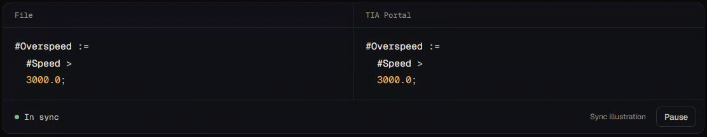
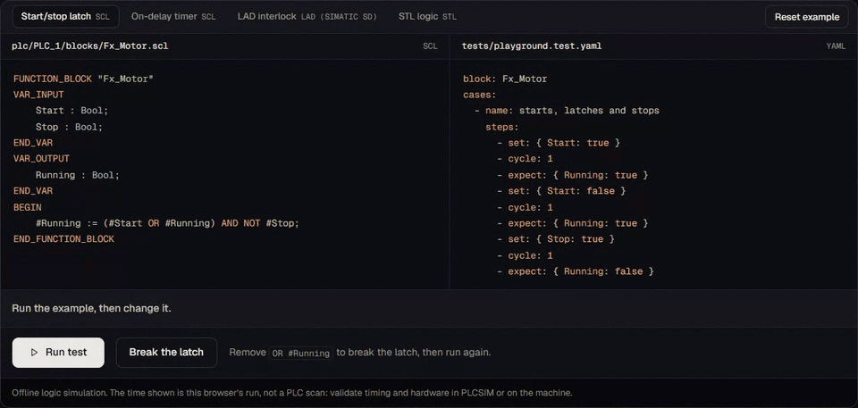
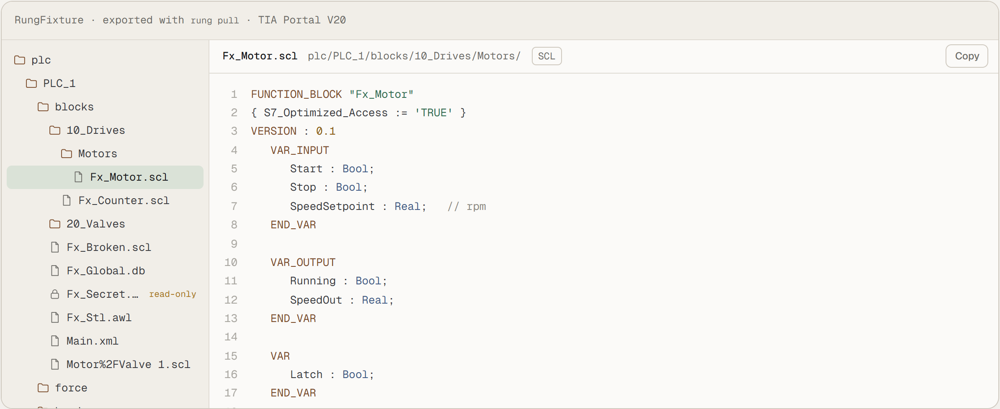

<p align="center">
  <picture>
    <source media="(prefers-color-scheme: dark)" srcset="site/assets/logo-dark.png">
    
  </picture>
</p>

<h3 align="center">TIA Portal projects, as plain text.</h3>

<p align="center">
  <a href="https://github.com/sa1ntsinner/rung/actions/workflows/ci.yml"></a>
  
  <a href="LICENSE"></a>
</p>

<p align="center">
  <a href="https://sa1ntsinner.github.io/rung/"><b>Website</b></a> ·
  <a href="https://sa1ntsinner.github.io/rung/#play">Try a test in your browser</a> ·
  <a href="docs/quickstart.md">Quickstart</a> ·
  <a href="docs">Docs</a>
</p>

<p align="center">
  
</p>

rung keeps a Siemens TIA Portal project, or a CODESYS one, and a folder of text files in sync, both ways. Edit in your editor, review in git, test without a PLC.

| | |
|---|---|
| **Two-way sync** | Save a file: rung imports it through Openness, compiles it and writes TIA's version back. Changes made in TIA Portal come back. Both sides changed: a three-way merge, SCL by line, LAD and FBD by network. |
| **An editor for SCL** | A language server for VS Code, Zed and Neovim: completion, definitions through DBs, UDTs and instances, references, rename through TIA Portal, any block or tag by name, TIA's compile errors on their line, live values. |
| **Tests without a PLC** | `rung test` runs YAML tests on an offline simulator: SCL, LAD, FBD, STL and structured text, with virtual time. Any CI runner, Linux too, no TIA Portal or PLCSIM. |
| **Coding agents** | An MCP server and skills. Agents edit the files, rung carries the change into TIA Portal, a person starts every download. |
| **Change review** <sub>Pro</sub> | Interfaces, attributes, logic per region and network, and what a change affects. A gate in your CI and a FAT/SAT record. |

## Try a test



The [playground](https://sa1ntsinner.github.io/rung/#play) runs rung's own simulator in your browser. The same tests run on your CI:

```yaml
- uses: sa1ntsinner/rung@v1        # a failing step shows on its line in the pull request
```

## Your project, as files

<picture>
  <source media="(prefers-color-scheme: dark)" srcset="docs/media/workspace-dark.png">
  
</picture>

One file per object: `.scl` `.awl` `.db` `.udt` `.s7dcl` `.xml` `.tags.st` `network.yaml` `.test.yaml`. The [format](docs/format/README.md) is documented and MIT.

## Measured against real TIA Portal

<picture>
  <source media="(prefers-color-scheme: dark)" srcset="docs/media/soak-dark.png">
  
</picture>

| Two 20-minute runs, two people, syncs killed at random | One production program | Tests |
|---|---|---|
| 0 conflicts, 0 check failures, every file equal to TIA Portal's export at the end ([evidence](docs/evidence.md)) | 42 of its 43 blocks run in `rung test`, 8 of them with stubs | 37/37 bridge tests on TIA Portal V20, 850+ TypeScript and 243 .NET tests, Windows and Linux |

## Quick start

```sh
rung init --project D:\TIA\Line3.ap20   # link this folder to a project open in TIA Portal
rung pull                               # blocks, types and tag tables as text
rung writes on                          # when you want your edits to go to TIA Portal
rung watch                              # keep both sides in sync
```

Pre-release: there is no public release yet. The [quickstart](docs/quickstart.md) covers the setup, including the Openness group your Windows user has to be in.

## Works with

| | Sync | Editor | `rung test` |
|---|:---:|:---:|:---:|
| Siemens TIA Portal V20 | ✓ | ✓ | ✓ |
| CODESYS V3.5 | ✓ | ✓ | ✓ |
| TwinCAT 3 sources | files already | ✓ | ✓ |

**Editors** VS Code and Zed extensions, a Neovim plugin · **Agents** Claude Code, Codex, Cursor, Gemini CLI (`rung setup`) · **Runs on** Windows; Linux and macOS through a Windows PC [over ssh](docs/remote.md) · **TIA Portal** V20 and V19; V21 opens projects, writes untested.

## Careful by default

- Only Siemens Openness talks to TIA Portal; rung never opens project files itself.
- Failsafe, know-how protected, system and GRAPH blocks and library instances stay read-only. Deleting a file never deletes a block: `rung confirm-delete` does.
- A person starts every [download](docs/downloads.md). Agents never do.

## License

The core is under the Business Source License 1.1: free for individuals, education, non-commercial open source and organizations with up to three users, and each release becomes Apache 2.0 after three years. Larger teams take rung Pro, €49 per user and month: the commercial license, change review, a CI policy gate, FAT/SAT records and support (smile0murr@gmail.com). The protocol client, grammar, editor extensions and file format are MIT. Details in [LICENSE](LICENSE).

rung is not affiliated with Siemens AG. TIA Portal and SIMATIC are trademarks of Siemens AG.

<details>
<summary>Working on rung</summary>

```sh
pnpm install
pnpm test                                         # TypeScript packages
dotnet test bridge/tests/Rung.Bridge.Core.Tests   # bridge core, no TIA Portal needed
```

The live tests against TIA Portal run headless, without windows or prompts; the steps are in [CONTRIBUTING.md](CONTRIBUTING.md).

</details>
