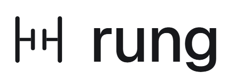

<p>
  <picture>
    <source media="(prefers-color-scheme: dark)" srcset="site/assets/logo-dark.png">
    
  </picture>
</p>

TIA Portal projects as plain text.

rung keeps a Siemens TIA Portal project, or a CODESYS project, and a folder of text files in sync, both ways. You write SCL or structured text in VS Code, Zed or Neovim, review changes in git like any other code, and coding agents work on the same files you do.

It's pre-alpha. It runs against TIA Portal V20 and CODESYS V3.5, and the full test suite passes on real projects of both, but there is no release yet.

## Quick start

```sh
rung init --project D:\TIA\Line3.ap20   # bind this folder to a project open in TIA Portal
rung pull                               # export blocks, types and tag tables as text
rung watch                              # keep both sides in sync until Ctrl+C
```

The [quickstart](docs/quickstart.md) walks through setup, including the Openness group your Windows user has to be in.

## What's in it

- Two-way sync. Save a file and rung imports it, compiles the block and writes TIA's version back. Changes made in TIA Portal come back to the files. If both sides changed, you get a line merge or a conflict to resolve.
- A language server for SCL and IEC structured text: completion, go to definition through DBs, UDTs and FB instances, references, rename, help on hover, quick fixes (declare a tag, define a PLC tag, create an instance DB, update a block call) and TIA's compile errors on the right line. There are extensions for [VS Code and Zed](docs/editors/README.md) and a config for Neovim.
- Monitoring like TIA Portal's: the values of a running block at the end of each line in the editor, from the PLC's Web API or `rung simulate`, a virtual PLC.
- An [MCP server and a Claude Code plugin](docs/agents/README.md), so agents can check sync status, compile, find usages and run tests.
- `rung test`, which runs YAML unit tests for SCL and LAD blocks on an offline simulator and prints JUnit. See [testing](docs/testing.md).
- Compile, go online, compare with the PLC and download, from the terminal or the editor. A person starts every download and allows each risky question TIA asks by name. See [downloads](docs/downloads.md).
- Tag tables as text, one tag per line (`Start AT %I0.0 : Bool;  // start button`), with the address and type checked as you type.
- Network settings as a file: IP addresses, subnet masks, routers and PROFINET device names of the PLC and its IO devices in `hardware/network.yaml`.
- Read-only views of hardware, HMI, technology objects and the project library (types, versions, which blocks are instances).

## What it won't do

rung talks to TIA Portal only through Siemens' Openness API. It never opens project files itself, and agents never download to a PLC. Failsafe, know-how protected, system and GRAPH blocks and instances of library types stay read-only, and deleting a file doesn't delete the block until you run `rung confirm-delete`.

## Requirements

Windows with TIA Portal V20 and the Openness option, or with CODESYS V3.5 (tested with SP22; see [CODESYS](docs/codesys.md)), and Node.js 22 or newer. TwinCAT projects are files already: rung's language server and simulator read them as they are.

<details>
<summary>Working on rung</summary>

```sh
pnpm install
pnpm test                                         # TypeScript packages
dotnet test bridge/tests/Rung.Bridge.Core.Tests   # bridge core, no TIA Portal needed
```

The live tests against TIA Portal run headless, without windows or prompts; the steps are in [CONTRIBUTING.md](CONTRIBUTING.md).

</details>

## License

The core is under the Business Source License 1.1. It's free for individuals, education, non-commercial open source and organizations with up to three users, and each version becomes Apache 2.0 three years after its release. The protocol client, grammar, editor extensions and file format are MIT. Details in [LICENSE](LICENSE).

rung is not affiliated with Siemens AG. TIA Portal and SIMATIC are trademarks of Siemens AG.
