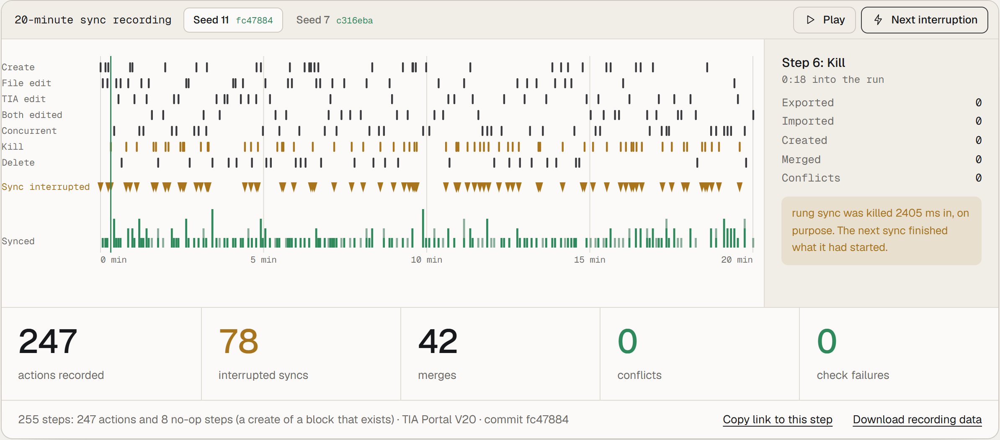

# Evidence

What has been measured, on which commit, and what it does and does not show.

## Sync under interruption

`tests/e2e/soak.e2e.test.ts` runs against a real TIA Portal V20: two people edit the same six blocks, one in the files and one in TIA Portal (a second Openness client), while `rung sync` runs and is killed at random moments, also in the middle of an import. After every step and at the end it checks:

- no conflict where nobody edited the same line;
- no crash and no stack trace from any sync;
- at the end, every file equals TIA Portal's export;
- both people's last values are there;
- nothing is left behind: no temporary or conflict files.

<picture>
  <source media="(prefers-color-scheme: dark)" srcset="media/soak-dark.png">
  
</picture>

| Run | Commit | Length | Steps | Syncs killed | Merges | Conflicts | Check failures |
|---|---|---|---|---|---|---|---|
| seed 11 | [fc47884](https://github.com/sa1ntsinner/rung/commit/fc47884) | 20 min | 255 | 78 | 42 | 0 | 0 |
| seed 7 | [c316eba](https://github.com/sa1ntsinner/rung/commit/c316eba) | 20 min | 276 | 75 | 48 | 0 | 0 |

The logs of both runs are in [media/soak.json](media/soak.json), one row per recorded action (seed 11: 247 rows for its 255 steps; the other 8 did nothing, such as creating a block that already exists; seed 7: all 276): seconds from the start, the action, after how many milliseconds the sync was killed (0: it ran to the end), and what the pass exported, imported, created, merged or found in conflict. Run it yourself with `RUNG_E2E=1 RUNG_SOAK_MINUTES=20 RUNG_SOAK_SEED=11 pnpm vitest run tests/e2e/soak.e2e.test.ts` on a PC with TIA Portal V20 and the fixture project ([CONTRIBUTING.md](../CONTRIBUTING.md)).

It shows that these sequences of edits, kills and merges lose nothing on that commit. It does not prove the same for every project, every TIA Portal update or every kind of object.

## One production program

42 of the 43 blocks of one real machine program run in `rung test`, 8 of them with stubs (communication, technology objects). The program is confidential, so no names; it does not stand for general compatibility. What the simulator covers and refuses is in [testing.md](testing.md).

## Tests

| | |
|---|---|
| Bridge integration tests against TIA Portal V20 | 37 of 37 |
| End to end against TIA Portal, S7-PLCSIM and CODESYS | pass |
| TypeScript tests | 850+ |
| .NET tests | 243 |
| CI runners | Windows and Linux |

The tests against TIA Portal, PLCSIM and CODESYS run on a PC with those tools installed, not on the CI runners; CI runs the rest on every push.
